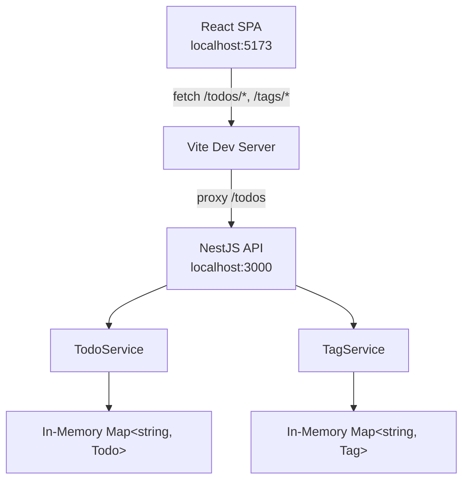

# Todo App — Technical Specification

## Architecture



### Component Overview

| Layer | Technology | Responsibility |
|-------|-----------|----------------|
| Frontend | React 19, Vite 6, TypeScript 5 | UI rendering, user interaction, API calls |
| Backend | NestJS 11, TypeScript 5 | REST API, validation, business logic |
| Storage | In-memory `Map` (todos and tags) | Data persistence (ephemeral, resets on restart) |

## Backend

### Module Structure

```
backend/src/
├── main.ts                     # Bootstrap, CORS, global validation pipe
├── app.module.ts               # Root module, imports TodoModule + TagModule
├── tag/
│   ├── tag.module.ts            # TagModule: controller + service
│   ├── tag.entity.ts            # Tag interface
│   ├── tag.controller.ts        # REST endpoints at /tags
│   ├── tag.service.ts           # In-memory tag store, unique names
│   ├── tag.service.spec.ts      # Unit tests (5 cases)
│   └── dto/
│       ├── create-tag.dto.ts    # CreateTagDto (name, color)
│       └── update-tag.dto.ts    # UpdateTagDto (optional fields)
└── todo/
    ├── todo.module.ts           # TodoModule: controller + service
    ├── todo.entity.ts           # Todo interface, TodoPriority enum
    ├── todo.controller.ts       # REST endpoints
    ├── todo.service.ts          # Business logic, in-memory store
    ├── todo.service.spec.ts     # Unit tests (12 cases)
    └── dto/
        ├── create-todo.dto.ts   # CreateTodoDto (title required, optional tagIds)
        └── update-todo.dto.ts   # UpdateTodoDto (all optional)
```

### API Contracts

#### `GET /todos`

Query parameters:
- `completed` (string `"true"` | `"false"`) — filter by completion status
- `priority` (string `"low"` | `"medium"` | `"high"`) — filter by priority
- `tagId` (string UUID) — filter todos whose `tagIds` includes this tag

Response: `200 OK` — `Todo[]` sorted by `createdAt` descending.

#### `GET /todos/:id`

Response: `200 OK` — `Todo` object. `404` if not found.

#### `POST /todos`

Body:
```json
{
  "title": "string (required, non-empty)",
  "description": "string (optional)",
  "priority": "low | medium | high (optional, default: medium)",
  "tagIds": "string[] (optional, default: [])"
}
```

Response: `201 Created` — the created `Todo` with generated `id`, `createdAt`, `updatedAt`.

Validation: `400 Bad Request` if `title` is missing/empty or `priority` is invalid.

#### `PUT /todos/:id`

Body (all fields optional):
```json
{
  "title": "string",
  "description": "string",
  "completed": "boolean",
  "priority": "low | medium | high",
  "tagIds": "string[]"
}
```

Response: `200 OK` — updated `Todo`. `404` if not found. `updatedAt` is refreshed.

#### `PATCH /todos/:id/toggle`

No body. Flips `completed` boolean.

Response: `200 OK` — updated `Todo`. `404` if not found.

#### `DELETE /todos/:id`

Response: `204 No Content`. `404` if not found.

#### Tag endpoints (`/tags`)

#### `GET /tags`

Response: `200 OK` — `Tag[]` (unordered).

#### `POST /tags`

Body:
```json
{
  "name": "string (required, non-empty)",
  "color": "string (required, #RRGGBB hex)"
}
```

Response: `201 Created` — created `Tag` with generated `id`.

Validation: `400` if fields invalid. `409 Conflict` if name duplicates an existing tag (case-insensitive).

#### `PUT /tags/:id`

Body (all fields optional):
```json
{
  "name": "string",
  "color": "string (#RRGGBB)"
}
```

Response: `200 OK` — updated `Tag`. `404` if not found. `409` on duplicate name when renaming.

#### `DELETE /tags/:id`

Response: `204 No Content`. `404` if not found.

### Validation

- Global `ValidationPipe` with `whitelist: true` (strips unknown properties) and `transform: true`
- DTOs use `class-validator` decorators: `@IsString`, `@IsNotEmpty`, `@IsOptional`, `@IsBoolean`, `@IsEnum`, `@IsArray`, `@Matches`

### Data Model

```typescript
enum TodoPriority {
  LOW = 'low',
  MEDIUM = 'medium',
  HIGH = 'high',
}

interface Todo {
  id: string;          // UUID v4
  title: string;
  description: string; // defaults to ""
  completed: boolean;  // defaults to false
  priority: TodoPriority; // defaults to MEDIUM
  tagIds: string[];    // defaults to []
  createdAt: Date;
  updatedAt: Date;
}

interface Tag {
  id: string;   // UUID v4
  name: string;
  color: string; // #RRGGBB
}
```

### Storage

In-memory `Map<string, Todo>` in `TodoService` and `Map<string, Tag>` in `TagService`. No persistence across restarts. IDs generated via `uuid` v4.

### Error Handling

- Missing resources throw `NotFoundException` (NestJS maps to 404)
- Duplicate tag names throw `ConflictException` (409)
- Validation failures return 400 with field-level error messages (handled by `ValidationPipe`)

## Frontend

### Component Tree

```
App
├── AddTodoForm       # Title input, expandable description/priority/tags
├── FilterBar         # Status tabs + priority + tag dropdowns
├── tag management    # "+ New Tag" inline create form
└── TodoItem[]        # Checkbox, content, tag chips, priority badge, actions
    ├── TagChips      # Colored tag pills (view mode)
    └── TagPicker     # Checkbox multi-select (add/edit)
```

### State Management

- React `useState` + `useCallback` hooks — no external state library
- `loading` flag for initial fetch
- `filter` (status), `priorityFilter` (priority), and `tagFilter` (tag) drive `api.list()` params
- `tags` loaded on mount via `api.tags.list()`; reloaded after creating a tag
- After every mutation (add/toggle/delete/update), the full todo list is re-fetched

### API Client (`api.ts`)

Generic `request<T>` wrapper around `fetch`:
- Sets `Content-Type: application/json` on all requests
- Throws on non-2xx responses
- Returns `undefined` for 204 responses

`api.tags`: `list()`, `create({ name, color })`, `remove(id)` — maps to `/tags` endpoints.

Todo helpers accept optional `tagIds` on create/update and optional `tagId` on `list()`.

### Styling

- CSS Modules (`.module.css` per component)
- CSS custom properties on `:root` for the dark theme palette
- No CSS framework or library

### Dev Server

Vite dev server on port 5173 with proxy:
- `/todos` → `http://localhost:3000` (the NestJS backend)

### Build

- `tsc -b && vite build` for production build
- Output: `frontend/dist/`

## Technology Decisions

| Decision | Choice | Rationale |
|----------|--------|-----------|
| Storage | In-memory Map | Simplicity; no DB setup for a demo app |
| IDs | UUID v4 | Globally unique, no sequential leaks |
| Validation | class-validator DTOs | NestJS idiomatic, declarative |
| Styling | CSS Modules | Scoped styles without runtime cost |
| State management | React hooks | Sufficient for single-page, no shared state complexity |
| Monorepo | npm workspaces (root) | `concurrently` runs both dev servers |

## Testing

- 17 unit tests across `todo.service.spec.ts` (12 cases) and `tag.service.spec.ts` (5 cases), covering:
  - Create with defaults and with `tagIds`
  - List all todos
  - Filter by completed status, priority, and `tagId`
  - Update fields including `tagIds`
  - Toggle completion
  - Remove todo
  - 404 on missing todo
  - Tag create, duplicate name rejection, update, delete, findOne 404
- Test runner: Jest with `ts-jest` transform
