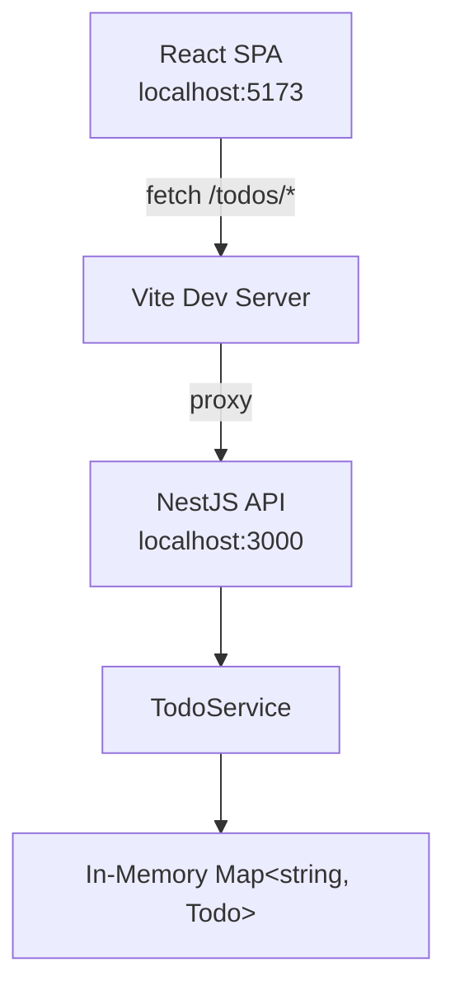

# Todo App — Technical Specification

## Architecture



### Component Overview

| Layer | Technology | Responsibility |
|-------|-----------|----------------|
| Frontend | React 19, Vite 6, TypeScript 5 | UI rendering, user interaction, API calls |
| Backend | NestJS 11, TypeScript 5 | REST API, validation, business logic |
| Storage | In-memory `Map<string, Todo>` | Data persistence (ephemeral, resets on restart) |

## Backend

### Module Structure

```
backend/src/
├── main.ts                     # Bootstrap, CORS, global validation pipe
├── app.module.ts               # Root module, imports TodoModule
└── todo/
    ├── todo.module.ts           # TodoModule: controller + service
    ├── todo.entity.ts           # Todo interface, TodoPriority enum
    ├── todo.controller.ts       # REST endpoints
    ├── todo.service.ts          # Business logic, in-memory store
    ├── todo.service.spec.ts     # Unit tests (8 cases)
    └── dto/
        ├── create-todo.dto.ts   # CreateTodoDto (title required)
        └── update-todo.dto.ts   # UpdateTodoDto (all optional)
```

### API Contracts

#### `GET /todos`

Query parameters:
- `completed` (string `"true"` | `"false"`) — filter by completion status
- `priority` (string `"low"` | `"medium"` | `"high"`) — filter by priority

Response: `200 OK` — `Todo[]` sorted by `createdAt` descending.

#### `GET /todos/:id`

Response: `200 OK` — `Todo` object. `404` if not found.

#### `POST /todos`

Body:
```json
{
  "title": "string (required, non-empty)",
  "description": "string (optional)",
  "priority": "low | medium | high (optional, default: medium)"
}
```

Response: `201 Created` — the created `Todo` with generated `id`, `createdAt`, `updatedAt`.

Validation: `400 Bad Request` if `title` is missing/empty or `priority` is invalid.

#### `PUT /todos/:id`

Body (all fields optional):
```json
{
  "title": "string",
  "description": "string",
  "completed": "boolean",
  "priority": "low | medium | high"
}
```

Response: `200 OK` — updated `Todo`. `404` if not found. `updatedAt` is refreshed.

#### `PATCH /todos/:id/toggle`

No body. Flips `completed` boolean.

Response: `200 OK` — updated `Todo`. `404` if not found.

#### `DELETE /todos/:id`

Response: `204 No Content`. `404` if not found.

### Validation

- Global `ValidationPipe` with `whitelist: true` (strips unknown properties) and `transform: true`
- DTOs use `class-validator` decorators: `@IsString`, `@IsNotEmpty`, `@IsOptional`, `@IsBoolean`, `@IsEnum`

### Data Model

```typescript
enum TodoPriority {
  LOW = 'low',
  MEDIUM = 'medium',
  HIGH = 'high',
}

interface Todo {
  id: string;          // UUID v4
  title: string;
  description: string; // defaults to ""
  completed: boolean;  // defaults to false
  priority: TodoPriority; // defaults to MEDIUM
  createdAt: Date;
  updatedAt: Date;
}
```

### Storage

In-memory `Map<string, Todo>` in `TodoService`. No persistence across restarts. IDs generated via `uuid` v4.

### Error Handling

- Missing resources throw `NotFoundException` (NestJS maps to 404)
- Validation failures return 400 with field-level error messages (handled by `ValidationPipe`)

## Frontend

### Component Tree

```
App
├── AddTodoForm       # Title input, expandable description/priority
├── FilterBar         # Status tabs (all/active/done) + priority dropdown
└── TodoItem[]        # Individual todo: checkbox, content, priority badge, actions
```

### State Management

- React `useState` + `useCallback` hooks — no external state library
- `loading` flag for initial fetch
- `filter` (status) and `priorityFilter` (priority) drive `api.list()` params
- After every mutation (add/toggle/delete/update), the full list is re-fetched

### API Client (`api.ts`)

Generic `request<T>` wrapper around `fetch`:
- Sets `Content-Type: application/json` on all requests
- Throws on non-2xx responses
- Returns `undefined` for 204 responses

### Styling

- CSS Modules (`.module.css` per component)
- CSS custom properties on `:root` for the dark theme palette
- No CSS framework or library

### Dev Server

Vite dev server on port 5173 with proxy:
- `/todos` → `http://localhost:3000` (the NestJS backend)

### Build

- `tsc -b && vite build` for production build
- Output: `frontend/dist/`

## Technology Decisions

| Decision | Choice | Rationale |
|----------|--------|-----------|
| Storage | In-memory Map | Simplicity; no DB setup for a demo app |
| IDs | UUID v4 | Globally unique, no sequential leaks |
| Validation | class-validator DTOs | NestJS idiomatic, declarative |
| Styling | CSS Modules | Scoped styles without runtime cost |
| State management | React hooks | Sufficient for single-page, no shared state complexity |
| Monorepo | npm workspaces (root) | `concurrently` runs both dev servers |

## Testing

- 8 unit tests in `todo.service.spec.ts` covering:
  - Create with defaults
  - List all todos
  - Filter by completed status
  - Filter by priority
  - Update fields
  - Toggle completion
  - Remove todo
  - 404 on missing todo
- Test runner: Jest with `ts-jest` transform
